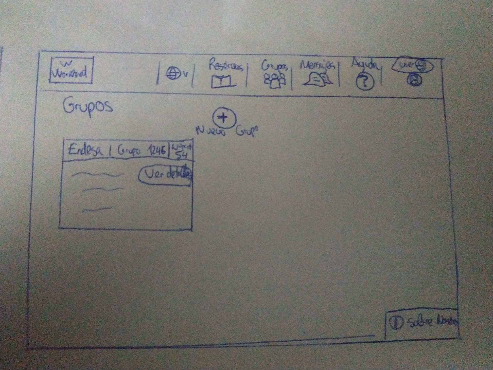

# Trabajo de Teoria de Diseño de Interfaces de Usuario
Plataforma de coworking. Curso: 2019/20

Autor:
* :bust_in_silhouette:   Luis Escobar Reche. 77142368T.

Logotipo: 

----- 

En este caso analizare una plataforma de coworking y realizare una propuesta para su diseño Web/movil. Utilizare herramientas y entregables descritos en el siguiente CheckList (https://github.com/mgea/UX-DIU-Checklist) 

Coworking es una forma de trabajo que permite a profesionales independientes, emprendedores, y pymes de diferentes sectores, compartir un mismo espacio de trabajo, tanto físico como virtual, para desarrollar sus proyectos profesionales de manera independiente, a la vez que fomentan proyectos conjuntos. Esto les permite compartir oficina y equipamientos, y constituye una propuesta más elaborada que por ejemplo los cibercafés, entornos en los que también se cuenta con conexión a internet.

# Proceso de Diseño 

## Paso 1. Desk Research & Analisis 

1.a Analisis Competitivo
-----
En el ámbito del coworking existen muchos sitios que ofrecen este servicio, pero no existe una aplicación o web que destaque sobre el resto, todas son bastante pobres. [ErrantT](https://www.errant.es/es/) es una página web que nos da información sobre el area de trabajo que ofrecen en Granada centro, a parte de esto solo nos permite mandar un formulario de contacto y poco mas. El motivo por el cual he elegido esta pagina es por que carece de
muchas funcionalidades que considero que se pueden implementar, como por ejemplo permitir check-in virtual, salas de reuniones virtuales, soporte en varias plataformas y que sobre todo tenga un diseño intuitivo y fluido, para que pueda atraer a clientes. Otras aplicaciones o paginas ofrecen un mejor diseño pero siguen sin aportar estas funcionalidades.

1.b Mapa de empatia del usuario
---- 

1.c Analisis de Usabilidad
---- 
 - Enlace al documento: 
[Revisión de usabilidad](templates/analisisUsabilidad.pdf)
 - Valoración final:
54/100
 - Comentario sobre la valoración:  
Después de valorar cada apartado de la plantilla y tras comentar algunos apartados, la puntuación final es de 54/100. La justificación de esta nota es que en general esta aplicación es muy incompleta, ofrece pocas funciones y poca ayuda online. En cuanto a rendimiento y diseño visual no esta mal, ofrece las características mas básicas de las habituales en una aplicación web.

## Paso 2. UX Design  

2.a Feedback Capture Grid
----
Mi propuesta de aplicación para coworking se llama WorkHard.
Consiste en una pagina web a corto plazo aunque se planea ampliar a otras plataformas a largo plazo.
Sus principales funciones y lo que la diferencia del resto es que no se basa en dar información de el espacio fisico donde se trabaja, tambien tiene un componente social. Basicamente tienes un perfil con tus datos de trabajo, puedes ver espacios de coworking basados en tu localización actual y compararlos, ademas se podria hacer check-in online para controlar a que hora entran los trabajadores de la empresa. Tambien se podria hacer grupos de trabajo con otros usuarios para meter a todos los miembros de la empresa, actuando como un chat pero dando otras funciones como la de check-in online. Por ultimo una manera de reservar tu puesto en el espacio de coworking.

2.b Tasks & Sitemap 
-----
En el sitemap hemos añadido:
Index.html: Será la página principal.
Grupos.html: Contendrá los grupos de trabajo del usuario.
Reservas.html: Contendrá las reservas del usuario, contandra la informacion del puesto reservado y el espacio de coworking.
Mensajes.html: En esta página el usuario podrá compartir mensajes con otro compañero o el grupo de la empresa.
Perfil.html: En esta página se almacenará toda la información asociada al usuario.
About.html: En esta página se almacenará toda la información acerca de la empresa y que sea de interés para los usuarios.
Ayuda.html: En esta página se almacenará información como preguntas frecuentes, etc. Cualquier tipo de ayuda para el usuario, además se le proporcionará información para que pueda contactar con el equipo de ayuda.

En esta tabla se ve que tareas se ejecutan con más frecuencia para distintos grupos de usuarios, en gris se marcan las tareas más importantes.
Consideramos estas tareas más importantes basándonos en que si estas funciones fallaran, la aplicación sería un fracaso, en cambio si fallan las otras seguiría siendo un gran fallo pero no un fallo crítico.

2.c Labelling 
----
He utilizado iconos que son muy utilizados hoy en dia en cualquier tipo de aplicación y creo que no confundirán al usuario.

2.d Wireframes
-----
El boceto consta de varias partes:

Pantalla principal: En ella se detallan las búsquedas de espacios de coworking. Además podrá ver un calendario con las reuniones pendientes del usuario. Sin estar logueado solo muestra informacion de la pagina web mostrando su funcionamiento y un boton para registrarse.

Grupos: En esta sección el usuario podrá ver los grupos de trabajo en los que esta ademas de poder crear uno nuevo.

Mensajes: En esta sección de la aplicación el usuario podrá hablar con sus grupos de trabajo o con un usuario en concreto, tambien se podra iniciar una videoconferencia online.

Perfil: En esta sección el usuario podrá ver su información personal y la que está de forma visible a todos los demás usuarios.

Reservas: En esta sección se encuentran todas las reservas del usuario.

2.e Logotipo
----

He usado para diseñarlo la herramienta [TailorBrands](https://www.tailorbrands.com/es/logo-maker). Esta herramienta es gratis pero se necesita la version pro para guardar los logos en varias resoluciones.

2.f Guidelines
----

Como tipografía principal de la aplicación he decidido optar por una tipografía moderna, sencilla y que sea perfectamente legible: Monserrat. Monserrat es una fuente de uso libre de Google Fonts. Esta tipografía la podemos combinar con otra tipografía como por ejemplo Open Sans, la cual es también muy utilizada, de uso libre y desarrollada por Google Fonts. Por tanto como tipografía principal empleamos Monserrat y como tipografía secundaria Open Sans. Respecto al tamaño de fuente hemos decidido seguir los estándares, un tamaño de 14-18px para el contenido principal mientras que para las cabeceras un tamaño de 28-34px. Respecto a Open Sans también seguimos los estándares, es decir, utilizar un tamaño de 12-16px para contenidos principales y un tamaño de 24-30px para cabeceras.

Monserrat:

Open Sans:

Respecto a los colores que voy a utilizar he optado por unos colores básicos para no generar confusión a los usuarios cuando usan nuestra aplicación y no se encuentren colores llamativos o incluso colores que molesten a la vista, un ejemplo perfecto de colores que queremos emplear:

Color de letra: Negro
Color de Títulos: Negro
Color de fondo: Blanco
Color de cabeceras y Barra de navegación inferior: Verde
Títulos en las cabeceras o en las barras de navegación: Blanco

Mi objetivo es utilizar el blanco y el negro para destacar el contenido, resaltando en verde las funciones importantes. Por tanto, el objetivo principal y por el cual usamos estos colores básicos es conseguir que el usuario navegue de forma mas fluida por nuestra aplicación.

La idea es que quede algo asi pero usando el un verde claro en lugar de rojo:

Respecto a los patrones:

En primer lugar, como patrón de organización de la información he decido implementar el patrón: Buscar/Navegar porque combina varios estilos para organizar la información y añade buscadores para mejorar la experiencia del usuario. Además, cuando un usuario se encuentre navegando puede realizar una búsqueda de forma sencilla sin tener que cambiar de localización dentro de la app.

Para cuando un usuario quiera hacer una búsqueda voy a introducir técnicas de autocompletado y cuando se obtengan los resultados también introduciremos la opción de filtrar los resultados.

Para el patrón de navegación he decidido usar la clasica barra de navegación superior, ya que aporta simpleza y mucha utilidad. Además, es bastante intuitiva.

## Conclusión

En conclusion, la web revisada y la gran mayoria de las que investigue son pobres en cuanto a funcionalidades y se remiten a mostrar información de los sitios fisicos. En muchas de estas ocasiones se mostraba esa información de manera desorganizada y causando confusion.
Considero que mi propuesta aunque es muy ambiciosa y llevaria bastante tiempo de desarrollo, no tiene competidores reales y supondria un cambio en el ámbito del Coworking, que considero que esta bastante extendido pero no tiene tanta fama ni reconocimiento al menos a nivel nacional.

